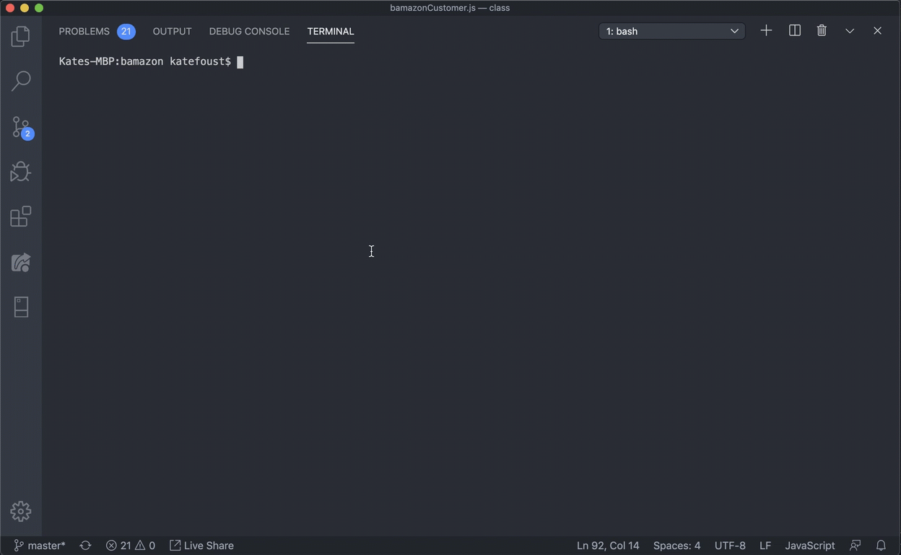

# bamazon

## About Bamazon

Welcome to Bamazon! An alernative to Amazon.com for those who perfer purchasing a limited and random set of products from their command line.

Bamazon is built using node.js and MySQL. It also uses Inquirer to simplify prompts for users who are unfamiliar with how node.js processes command line arguments. 

## Set Up

Setting up Bamazon is pretty easy. You will need to download a couple things first: 

* This Git Respository
* [MySQL Workbench] (https://www.mysql.com/products/workbench)

Once you've downloaded the git repo, open it and use the command line to `cd` to the root of the file. You'll know you are at the root if you see this readme and the file `bamazonCustomer.js`. 

    

