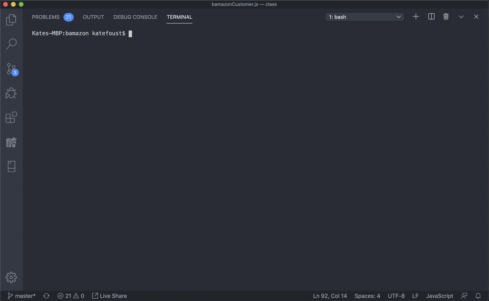
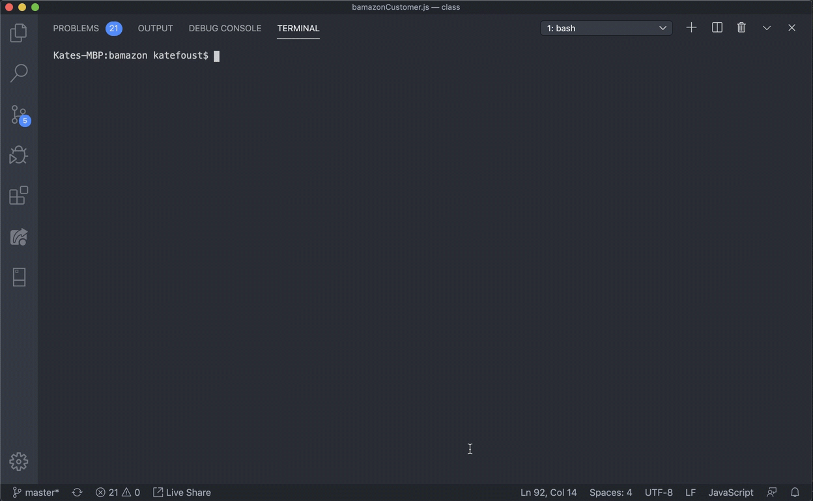
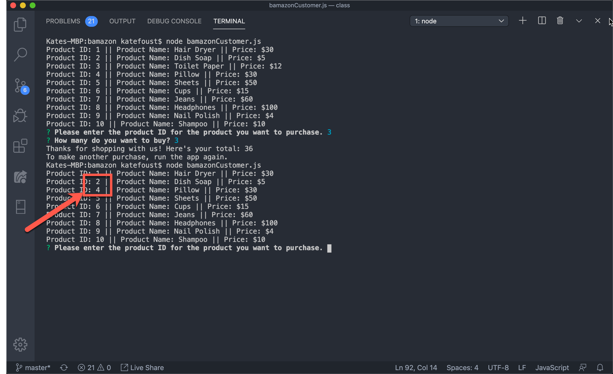

# bamazon

## About Bamazon

Welcome to Bamazon! An alernative to Amazon.com for those who perfer purchasing a limited and random set of products from their command line.

Bamazon is built using node.js and MySQL. It also uses Inquirer to simplify prompts for users who are unfamiliar with how node.js processes command line arguments. 

## Set Up

Setting up Bamazon is pretty easy. You will need to download a couple things first: 

* This Git Respository
* [MySQL Workbench](https://www.mysql.com/products/workbench)

### Set Up the App

Once you've downloaded the git repo, open it and use the command line to `cd` to the root of the file. You'll know you are at the root if you see this readme and the file `bamazonCustomer.js`. 

Use `ls` to see where you are. 

Once you are in the root of the folder, run `npm i`. This will install the packages you need to make the app work. In this case, you are installing packages for Inquirer and MySQL. 

### Create the Database

Currently, the Bamazon app only runs locally, which means you'll have to create the database yourself. 

To create a database: 

1. Open MySQL Workbench and connect to your local instance.
1. Open the `bamazon.sql` script and run it. This will create the database and a table with  product data. 
1. Open `bamazonCustomer.js` in your IDE. 
1. Inside the `connection` object, starting on line 4, make sure the port you're using and your username are reflected. 
1. On line 14, enter your MySQL password. 
1. To test your connection, run `node bamazonCusomter.js`. If the connection is successful, you'll see the first user prompt described in the next section, "Making Purchases with the Bamazon App"

### Making Purchases with the Bamazon App. 

Now that you've set up the app and database on your local instance, you can start "purchasing" items on Bamazon. 

To make a purchase: 

1. Run `node bamazonCustomer.js`. You'll see a list of products and prices and a prompt to choose a product. 
1. Follow the prompt. When you enter the number of units you want to purchase, Bamazon will check to see if there are enough units in stock. 

    1. If there are enough units in stock, you will see the total cost of your purchase. 
    
        
        
    1. If there are not enough units in stock, you'll see a message telling you there aren't enough items. 
        
        
        
        **Note**: We don't want to waste your time with items that are completely out of stock. We've made sure these items do not return when you are making your purchase selection. 
        
        
        
        
        
        

That's all you need to know. Enjoy Bamazon!

## Contributors

Kate Foust

